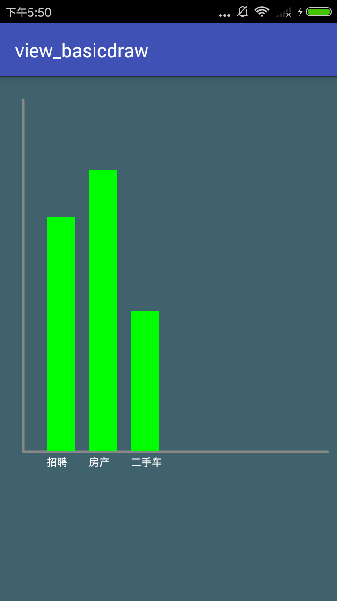
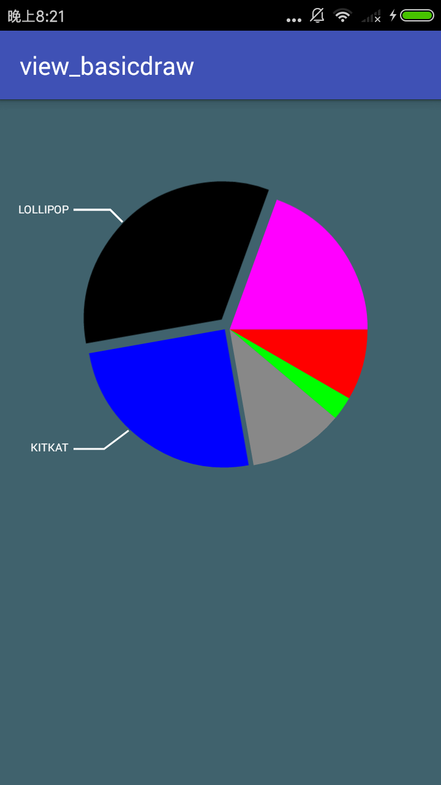

## View 绘制练习demo

### paint 相关
```java
paint.setColorFilter(ColorFilter)
```
ColorFilter 不能直接使用，要通过其子类
ColorFilter 的3个子类
+ -- ColorMatrix
    + -- ColorMatrixColorFilter (4x5 的颜色矩阵来处理)
    + -- LightingColorFilter (16进制数，来增强某个颜色的强度)
    + -- PorterDuffColorFilter (混合式, 使用PorterDuff.Mode)

```java
bitmap = BitmapFactory.decodeResource(getResources(), R.mipmap.test);


// 1. ColorMatrix
ColorMatrix colorMatrix = new ColorMatrix(new float[]{
                0.5f, 0, 0, 0, 0,
                0, 0.5f, 0, 0, 0,
                0, 0, 0.5f, 0, 0,
                0, 0, 0, 1f, 0
        });
paint.setColorFilter(new ColorMatrixColorFilter(colorMatrix));


// 2. LightingColorFilter
paint.setColorFilter(new LightingColorFilter(0xff00ff, 0));


// 3. PorterDuffColorFilter
PorterDuffColorFilter filter = new PorterDuffColorFilter(Color.parseColor("#22ff00"), PorterDuff.Mode.SRC_OUT);
paint.setColorFilter(filter);

// 参考：http://wuxiaolong.me/2016/08/20/Paint/
```

### path 相关


### Demo 效果
      