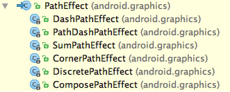

## View 绘制练习demo

### paint 相关
```java
paint.setColorFilter(ColorFilter)
```
ColorFilter 不能直接使用，要通过其子类
ColorFilter 的3个子类
+ -- ColorMatrix
    + -- ColorMatrixColorFilter (4x5 的颜色矩阵来处理)
    + -- LightingColorFilter (16进制数，来增强某个颜色的强度)
    + -- PorterDuffColorFilter (混合式, 使用PorterDuff.Mode)

```java
bitmap = BitmapFactory.decodeResource(getResources(), R.mipmap.test);


// 1. ColorMatrix
ColorMatrix colorMatrix = new ColorMatrix(new float[]{
                0.5f, 0, 0, 0, 0,
                0, 0.5f, 0, 0, 0,
                0, 0, 0.5f, 0, 0,
                0, 0, 0, 1f, 0
        });
paint.setColorFilter(new ColorMatrixColorFilter(colorMatrix));


// 2. LightingColorFilter
paint.setColorFilter(new LightingColorFilter(0xff00ff, 0));


// 3. PorterDuffColorFilter
PorterDuffColorFilter filter = new PorterDuffColorFilter(Color.parseColor("#22ff00"), PorterDuff.Mode.SRC_OUT);
paint.setColorFilter(filter);

// 4. shader
如：LinearGradient
shader = LinearGradient(0f, 0f, measuredWidth.toFloat(), measuredHeight.toFloat(),
                resources.getColor(R.color.recording_btn_color0), resources.getColor(R.color.recording_btn_color1),
                Shader.TileMode.CLAMP)
mPaint.shader = shader

/**
 * LinearGradient 的坐标都是以此view 的位置(左上角定点)作为参考点
 * draw 图形，也是以此view 的位置(左上角定点)作为参考点
 * 不然可能画出的没效果
 */

// 参考：http://wuxiaolong.me/2016/08/20/Paint/
```

### path 相关
* moveTo() 移动path 的绘制起点
* lineTo(), arcTo() 等等用法类似
* close() 连接起点和重点，形成封闭的图形


        注意： 如果 canvas.drawPath() 不起作用时，设置 paint 的style 试试

**Path 的填充原理**

EVEN_ODD 和 WINDING 的原理

* EVEN_ODD：even-odd rule 奇偶原则
一条线穿过图形，如果交点个数为偶数，则认为这个点为 **外部**，否则就在内部；
内部的区域，会被填充
* WINDING：non-zero winding rule 非零环绕数原则
假设2个图形边框有绘制顺序：顺时针为 +，逆时针为 -，一条线穿过图形，如果经过的 交点和 为 非0，这个点就在内部； 否则就在外部

参考：
http://hencoder.com/ui-1-1/

### shader 相关
paint.setShader()


PorterDuff.Mode 总共有 17 种

### Xfermode 使用
必须要设置 离屏缓冲，有2中方式
1. canvas.saveLayer(), canvas.restore()
2. view.setLayerType()
注意：
    必须要关闭硬件加速（用 GPU 来渲染view）


### PathEffect
用于改变 path 的线条样式




### Demo 效果
      
